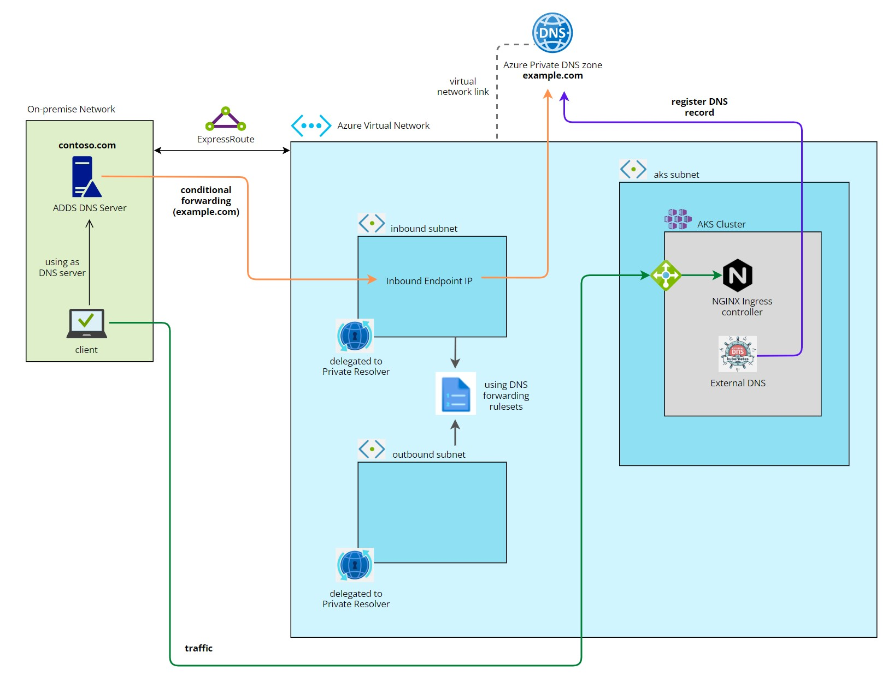

In this article, we will see how to resolve names of the K8s services running in [AKS](https://azure.microsoft.com/en-us/products/kubernetes-service/#overview) (Azure Kubernetes Service) from an on-premise desktop or server which is using DNS server running as part Active Directory Domain Controller.
The assumption is that the company has a private connection with Azure using offerings like Expressroute.

We will also make use of [Azure DNS Private Resolver](https://learn.microsoft.com/en-us/azure/dns/dns-private-resolver-overview) which is quite a new PAAS solution and also allow us to use Conditional Forwarding from on-premise DC where before we would have to use some other target DNS server like for example custom [CoreDNS](https://coredns.io/) deployed with etcd as backend in K8s which would be propagated by [External DNS](https://github.com/kubernetes-sigs/external-dns). With Azure DNS Private Resolver we can also utilize Azure private DNS zone which will be also integrated with External DNS running in AKS.

Here are some of the components we will be using and configuring:

* Azure DNS private resolver, DNS forwarding ruleset, Azure private DNS zone
* AKS deployed in a subnet with Azure Container Networking Interface (CNI)
* NGINX ingress controller and External DNS installed in K8s
* Active Directory Domain Controller with DNS service

In our lab, we will use only one VNet and deploy DC (with DNS service) in one of the subnets from which we will test the name resolution of our AKS service. However, in a real-life scenario, you probably want to consider multiple VNets (like hub one for example) also worth to mention this solution will also work if your DC is not on-premise but in Azure.

### Create VNet

Create the following subnets:

* **aks-subnet** - this is where AKS pods and services IPs will be deployed
* **dc-subnet** - where we will deploy a domain controller
* **snet-inbound-subnet** - inbound private resolver subnet where we will have conditional forwarding IP
* **snet-outbound-subnet** - outbound private resolver subnet used when we try to resolve the on-premise address from AKS

We are using azure cli for most of deployments rest will be done in Azure portal.

    az network vnet create \
        --name main-vnet \
        --resource-group dns-rg \
        --location eastus \
        --address-prefix 10.0.0.0/16 \
        --subnet-name aks-subnet \
        --subnet-prefixes 10.0.1.0/24

    az network vnet subnet create \
        --address-prefix 10.0.2.0/24 \
        --name dc-subnet \
        --resource-group dns-rg \
        --vnet-name main-vnet

    az network vnet subnet create \
        --address-prefix 10.0.0.0/28 \
        --name snet-inbound-subnet \
        --resource-group dns-rg \
        --vnet-name main-vnet

    az network vnet subnet create \
        --address-prefix 10.0.0.16/28 \
        --name snet-outbound-subnet \
        --resource-group dns-rg \
        --vnet-name main-vnet

### Deploy AKS

Ensure to enable managed identity which we will use to grant permissions to various resources used by AKS.

    az aks create \
        -g dns-rg\
        -n aks-dev \
        --enable-managed-identity \
        --load-balancer-sku standard \
        --node-count 1 \
        --generate-ssh-keys \
        --network-plugin azure \
        --vnet-subnet-id /subscriptions/<subscription id>/resourceGroups/dns-rg/providers/Microsoft.Network/virtualNetworks/main-vnet/subnets/aks-subnet \
        --docker-bridge-address 172.17.0.1/16 \
        --dns-service-ip 10.2.0.10 \
        --service-cidr 10.2.0.0/24 \
        --node-vm-size Standard_B2s

### Create Azure private DNS zone

In our case, we will name AKS dns zone **example.com** but in real life, you should use a more specific name like for example **k8s.companyname.com** or even per environment **dev.k8s.companyname.com**.
Then we link DNS zone with VNet so that resources inside this VNet are aware of the DNS zone.

    az network private-dns zone create -g dns-rg -n example.com

    az network private-dns link vnet create \
        -g dns-rg \
        -n mylink \
        -z example.com \
        -v main-vnet \
        --registration-enabled false

### Deploy NGINX ingress controller

Before we can deploy anything you need to get access credentials for AKS:

    az aks get-credentials --name aks-dev --resource-group dns-rg --overwrite-existing --admin

Also to make working with K8s much easier especially when you are new to this subject I highly recommend [Visual Studio Code](https://code.visualstudio.com/) with [Kubernetes extension](https://marketplace.visualstudio.com/items?itemName=ms-kubernetes-tools.vscode-kubernetes-tools), it offers a graphical interface so you don't need to know all the kubectl commands upfront.

First, we have to assign appropriate roles to managed identity which is used by AKS so that when we create K8s service for NGINX ingress controller Azure will be able to allocate IP inside our aks subnet.

    export AZ_PRINCIPAL_ID=$(
        az aks show -g dns-rg -n aks-dev \
            --query "identity.principalId" \
            --output tsv
    )

    az role assignment create --role "Reader" --assignee $AZ_PRINCIPAL_ID --scope /subscriptions/<subscription id>/resourceGroups/dns-rg
    az role assignment create --role "Network Contributor" --assignee $AZ_PRINCIPAL_ID --scope /subscriptions/<subscription id>/resourceGroups/dns-rg/providers/Microsoft.Network/virtualNetworks/main-vnet

Before we deploy NGINX ingress controller create this Helm values file, it will instruct AKS to create an internal load balancer and allocate static IP to it.

Content of the file **internal-ingress.yaml**

    controller:
        service:
            loadBalancerIP: 10.0.1.251
            annotations:
                service.beta.kubernetes.io/azure-load-balancer-internal: "true"

Now we deploy NGINX ingress controller using helm, everything will be deployed in **default** namespace:

    helm repo add ingress-nginx https://kubernetes.github.io/ingress-nginx
    helm repo update
    helm install ingress-nginx ingress-nginx/ingress-nginx \
        --namespace default \
        --set controller.service.annotations."service\.beta\.kubernetes\.io/azure-load-balancer-health-probe-request-path"=/healthz \
        -f internal-ingress.yaml

Once finished you should check if the service load balancer IP has been created.

### Deploy External DNS

Before we deploy External DNS we need to provide access to managed identity assigned to AKS to the Private Azure DNS zone so that it can create new records.

    export AZ_PRINCIPAL_ID=$(
        az aks show -g dns-rg -n aks-dev \
            --query "identityProfile.kubeletidentity.objectId" \
            --output tsv
    )

    az role assignment create --role "Private DNS Zone Contributor" --assignee $AZ_PRINCIPAL_ID --scope /subscriptions/<subscription id>/resourceGroups/dns-rg/providers/Microsoft.Network/privateDnsZones/example.com

Before we deploy External DNS create this Helm values file, it will be used among other things to create a secret which external DNS will use to reach Azure private DNS zone.

content of the file **external-dns.yaml**

    provider: azure-private-dns
    azure:
        resourceGroup: "dns-rg"
        tenantId: "<azure tenant id>"
        subscriptionId: "<subscription id>"
        useManagedIdentityExtension: true
    logLevel: debug
    domainFilters:
        - example.com
    txtOwnerId: external-dns
    interval: "10s"

Now we will use helm to deploy external DNS into default namespace:

    helm repo add bitnami https://charts.bitnami.com/bitnami
    helm repo update
    helm install external-dns bitnami/external-dns \
        --namespace default \
        -f external-dns.yaml

Once deployed check external dns pod logs and look for any errors the refresh is set to 10s so you should be able to see straight away if something is wrong.

### Deploy sample appplication

Now its time to deploy our sample application and check if the DNS record will be created.

Create the following file.

Content of the file **nginx-sample.yaml**

    apiVersion: apps/v1
    kind: Deployment
    metadata:
    name: nginx
    namespace: default
    spec:
    selector:
        matchLabels:
        app: nginx
    template:
        metadata:
        labels:
            app: nginx
        spec:
        containers:
        - image: nginx
            name: nginx
            ports:
            - containerPort: 80
    ---
    apiVersion: v1
    kind: Service
    metadata:
    name: nginx-svc
    namespace: default
    spec:
    ports:
    - port: 80
        protocol: TCP
        targetPort: 80
    selector:
        app: nginx
    type: ClusterIP

    ---
    apiVersion: networking.k8s.io/v1
    kind: Ingress
    metadata:
    name: nginx
    namespace: default
    annotations:
        kubernetes.io/ingress.class: nginx
    spec:
    rules:
    - host: server.example.com
        http:
        paths:
        - path: /
            pathType: Prefix
            backend:
            service:
                name: nginx-svc
                port:
                number: 80

Now deploy the app using kubectl:

    kubectl apply -f nginx-sample.yaml

If everything went fine you should see following entries in your external DNS pod as it refresh it's state every 10 seconds:

    level=debug msg="Retrieving Azure Private DNS zones for Resource Group 'dns-rg'"
    level=debug msg="Validating Zone: example.com"
    level=debug msg="Found 1 Azure Private DNS zone(s)."
    level=debug msg="Retrieving Azure Private DNS Records for resource group 'dns-rg'"
    level=debug msg="Retrieving Azure Private DNS Records for zone 'example.com'."
    level=debug msg="Failed to extract targets for 'example.com' with type 'SOA'."
    level=debug msg="Found TXT record for 'a-server.example.com' with target '\"heritage=external-dns,external-dns/owner=external-dns,external-dns/resource=ingress/default/nginx\"'."
    level=debug msg="Found A record for 'server.example.com' with target '10.0.1.251'."
    level=debug msg="Found TXT record for 'server.example.com' with target '\"heritage=external-dns,external-dns/owner=external-dns,external-dns/resource=ingress/default/nginx\"'."
    level=debug msg="Returning 3 Azure Private DNS Records for resource group 'dns-rg'"

Now if you will go to **example.com** zone in Azure portal you should see following entries which points our **server.example.com** record to NGINX ingress controller static IP 10.0.1.251.

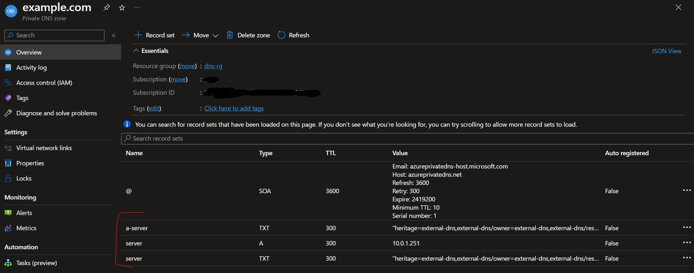

### Deploy and configure Azure DNS private resolver

In Azure portal search for **DNS private resolvers** then go to **Create DNS private resolver** and specify details including the VNet that we created in previous steps.

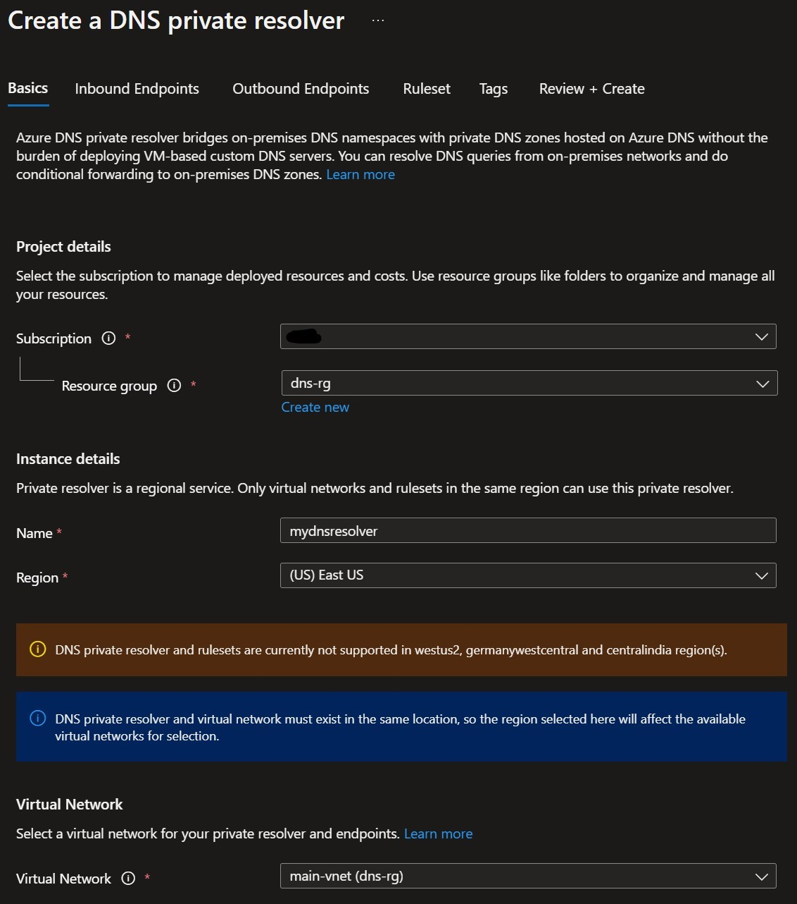

Next we will specify inbound endpoint by specifying our **snet-inbound-subnet**

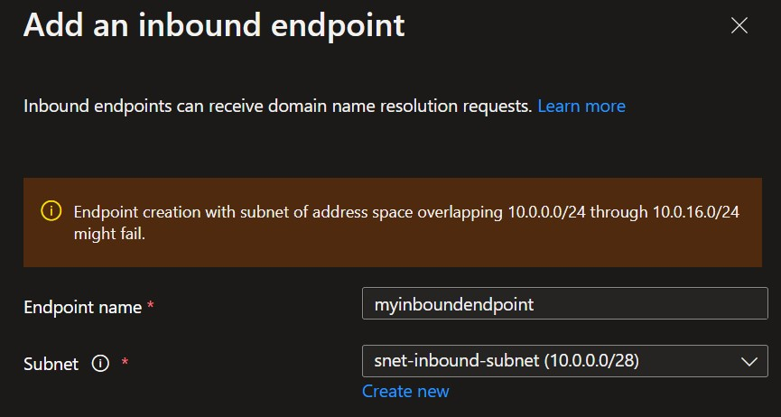

Same for outbound endpoint by specifying our **snet-outbound-subnet**

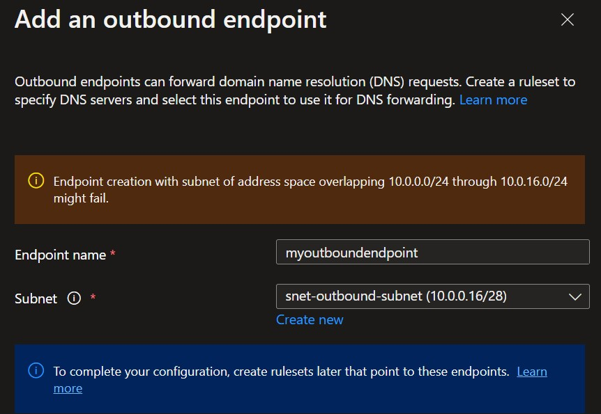

Once done you can deploy the Private resolver since we will add a ruleset in next step. After deployment both subnets should be delegated to dns resolver.

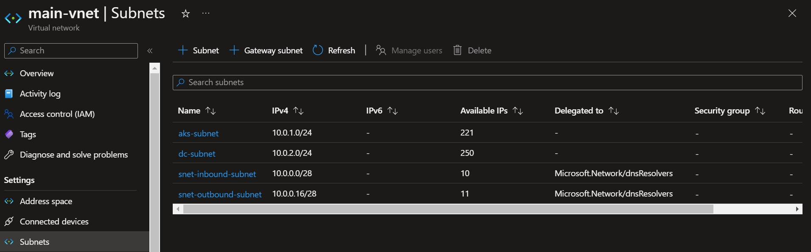

Now search for **DNS forwarding rulesets** and choose **Create DNS forwarding ruleset**

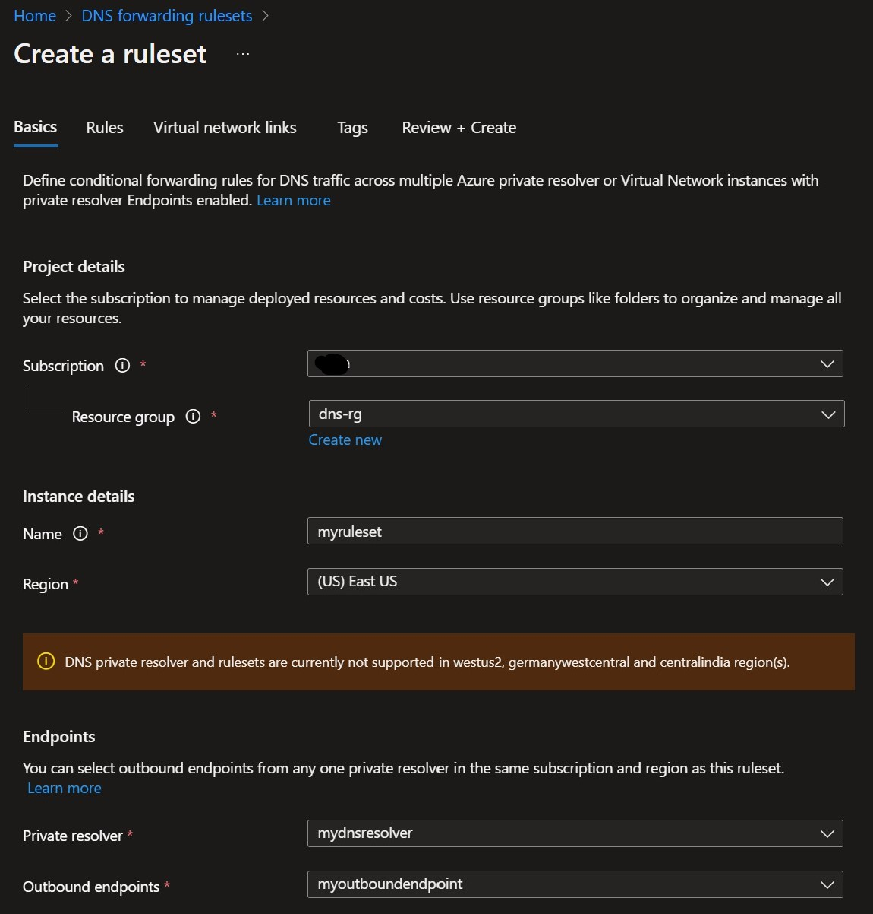

Next, we will add a rule that will be used for conditional forwarding from the on-premise DNS server.
The destination IP is the IP of our inbound endpoint and the domain is the one we chose for our AKS workloads.

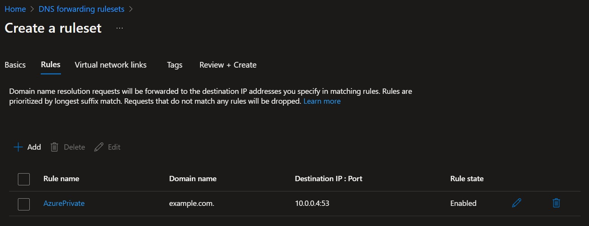

Now we need to link our VNet to the ruleset.

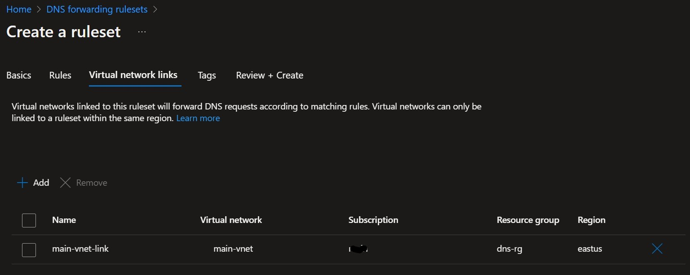

### Configure conditional forwarding from DNS server

(This article do not cover how to deploy and configure Active Directory domain controller but it is easy click-through experience)

We will now add conditional forwarding rule in DNS server to our inbound endpoint IP.

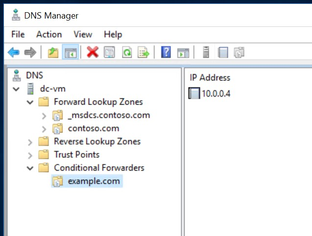

Also as a quick test let's run nslookup and check if there is an NGINX ingress controller IP when we try to resolve **server.example.com**.

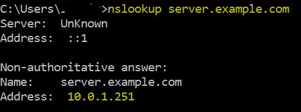

### Test to see if we can reach AKS service

Now that everything is in place type in web browser on domain controller server following address **http://server.example.com** you should see nginx welcome page.

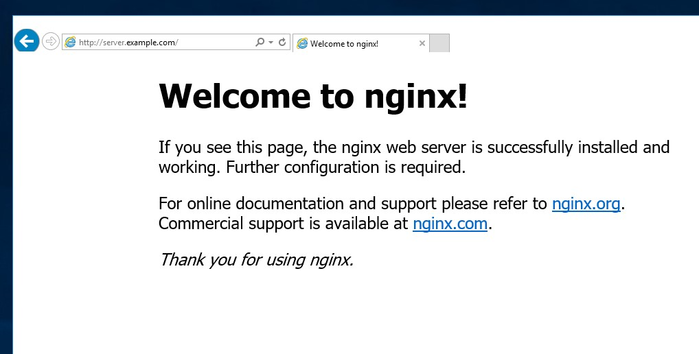

### Finall thoughts

We haven't covered name resolution from AKS to the on-premise server but it can be achieved by creating another rule in DNS ruleset and pointing to the IP of our on-premise DNS servers. To achieve this without Azure private resolver you can also modify AKS DNS (CoreDNS) configuration with your own custom config.

We did a test from the domain controller but if you want to deploy client test machine in Azure make sure that VNet where it is deployed has the domain controller IP in the **DNS Servers** tab.

Overall I like the idea of not having to worry about managing DNS servers either in AKS or deployed as a separate VM and just using PAAS solutions like Azure private DNS with DNS private resolver it definitely looks good in this simple POC.

### Aditional resources

[What is Azure DNS Private Resolver?](https://learn.microsoft.com/en-us/azure/dns/dns-private-resolver-overview)

[Quickstart: Create an Azure DNS Private Resolver using the Azure portal](https://learn.microsoft.com/en-us/azure/dns/dns-private-resolver-get-started-portal)

[Set up ExternalDNS for Azure Private DNS](https://github.com/kubernetes-sigs/external-dns/blob/master/docs/tutorials/azure-private-dns.md)

