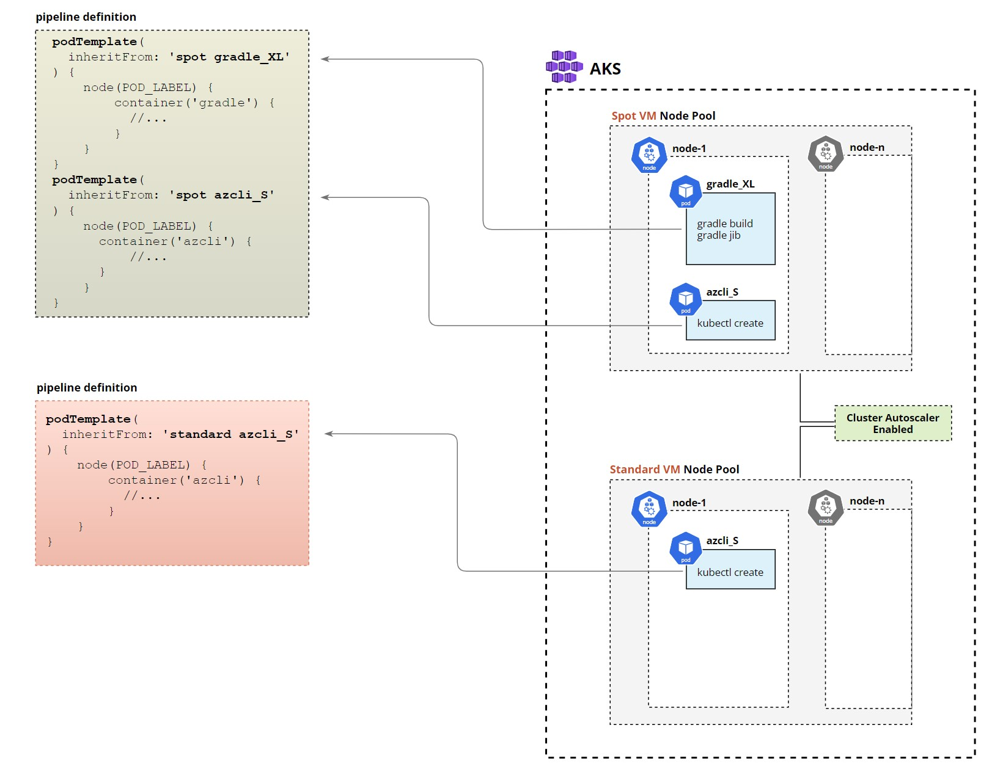
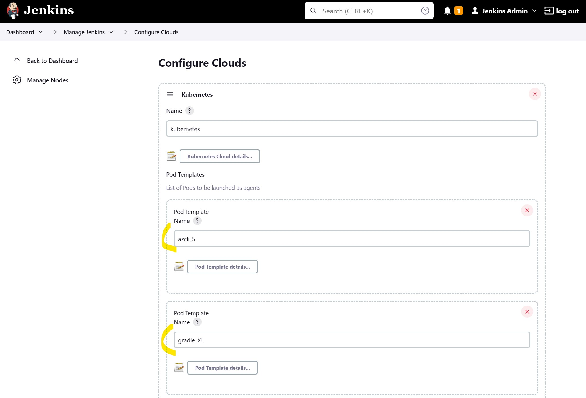
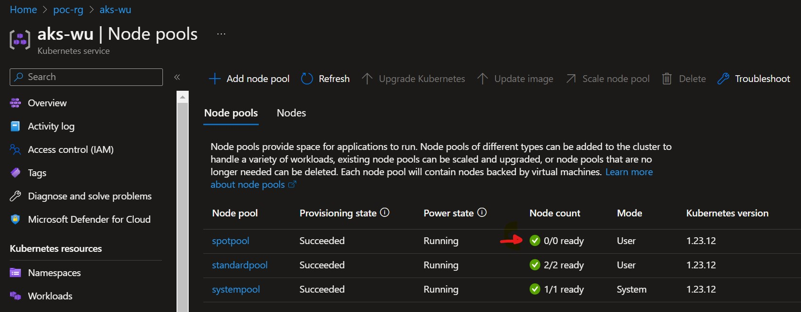
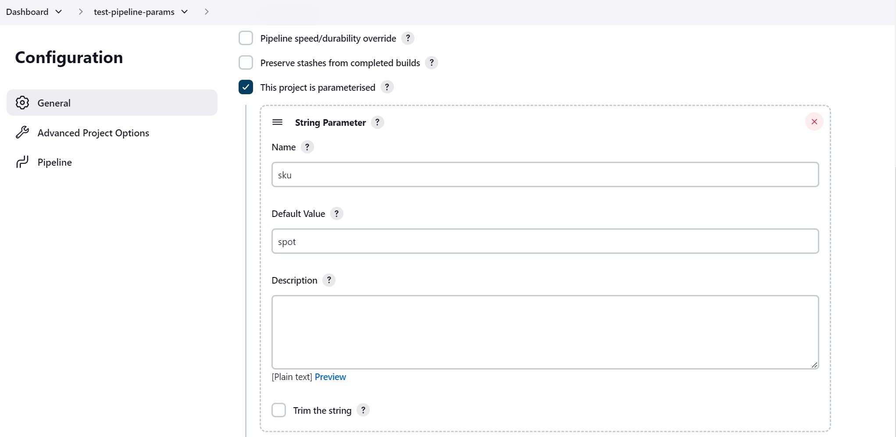

This is third article from the series **Jenkins on Azure Kubernetes Cluster (AKS)**:

1. [Jenkins on Azure Kubernetes Cluster (AKS) - How to recover Jenkins controller from Azure availability zone or region failure](https://rhollins.github.io/content/posts/jenkins-on-azure-kubernetes-cluster-aks-how-to-recover-jenkins-controller-from-azure-availability-zone-or-region-failure/)

2. [Jenkins on Azure Kubernetes Cluster (AKS) - How to build container images with BuildKit, Jib, Kaniko and use Azure Files NFS, Azure Container Registry (ACR) and Azure Blob storage for caching](https://rhollins.github.io/content/posts/jenkins-on-azure-kubernetes-cluster-aks-how-to-build-container-images-with-buildkit-jib-kaniko-and-use-azure-files-nfs-azure-container-registry-acr-and-azure-blob-storage-for-caching/)

3. Jenkins on Azure Kubernetes Cluster (AKS) - Flexible and cost effective Jenkins Agents with Kubernetes Cluster Autoscaler and Azure Spot Virtual Machines

Table of contents

* [What we will cover in this article](#what-we-will-cover-in-this-article)
* [Setting up our environment](#setting-up-our-environment)
    * [Adding node pools](#adding-node-pools)
    * [Deploying Jenkins and configuring agents templates](#deploying-jenkins-and-configuring-agents-templates)
* [Running multi-pod pipeline](#running-multi-pod-pipeline)
    * [Using parameters to switch between spot and standard node pools](#using-parameters-to-switch-between-spot-and-standard-node-pools)
* [Final thoughts](#final-thoughts)

## What we will cover in this article

One of the main benefits of using the public cloud is at least in theory "unlimited" compute resources you can use for your workloads however even if you will adhere to the best practice of scaling up and down all your workloads cost can still be quite siginficant.

For some time now Microsoft is offering [Azure Spot VMs](https://azure.microsoft.com/en-gb/products/virtual-machines/spot/#overview) which can offer around 90% compute cost reduction so for example where normally you would pay $1,500 a month for machine with 32 cores and 128GB of memory you can get it for just $180, this is huge cost saving but as always there are limitations, here are some of them:
* VM can be deallocated or deleted anytime with just 30 seconds of notification
* There is no guarantee you will be able to create a new machine when you need it
* You need to request Microsoft to increase your Spot vCPU family quotas (and it is not guaranteed)

> You can find more information about Azure Spot VMs and their limitations here [How to build workloads on spot virtual machines](https://learn.microsoft.com/en-us/azure/virtual-machines/spot-vms), [Use Azure Spot Virtual Machines](https://learn.microsoft.com/en-us/azure/virtual-machines/spot-vms)

There are only specific types of workloads that can benefit from spot VMs and CI/CD pipelines are one of those.

In this article, we will cover how to utilize Azure Spot VMs with Jenkins agents running on Azure Kubernetes Cluster (AKS) with Cluster Autoscaler enabled which can scale down Kubernetes node pools to 0 when we don't need them and scale up when we have new pipelines being triggered.

## Setting up our environment

You can reference previous articles to deploy some of the components that we will use in this post:
* AKS and Jenkins deployment was covered in [Jenkins on Azure Kubernetes Cluster (AKS) - How to recover Jenkins controller from Azure availability zone or region failure.](https://rhollins.github.io/content/posts/jenkins-on-azure-kubernetes-cluster-aks-how-to-recover-jenkins-controller-from-azure-availability-zone-or-region-failure/).
* Azure Container Registry and Service Principle account was covered in [Jenkins on Azure Kubernetes Cluster (AKS) - How to build container images with BuildKit, Jib, Kaniko and use Azure Files NFS, Azure Container Registry (ACR) and Azure Blob storage for caching](https://rhollins.github.io/content/posts/jenkins-on-azure-kubernetes-cluster-aks-how-to-build-container-images-with-buildkit-jib-kaniko-and-use-azure-files-nfs-azure-container-registry-acr-and-azure-blob-storage-for-caching/)

We will also need to provide AKS Cluster Managed Identity (assigned to the nodes) with Contributor permission to AKS so that we can utilize kubectl and deploy the pod into the AKS.

      export AZ_PRINCIPAL_ID=$(
        az aks show -g poc-rg -n aks-wu \
          --query "identityProfile.kubeletidentity.objectId" \
          --output tsv
      )

      az role assignment create --role "Contributor" --assignee $AZ_PRINCIPAL_ID --scope --scope /subscriptions/<subscription_id>/resourceGroups/poc-rg/providers/Microsoft.ContainerService/managedClusters/aks-wu

### Adding node pools

Once we have AKS running we will add two separate node pools one based on spot VMs to run workloads that can be interrupted and the other based on standard VMs this one will be used for a pipeline that deploys our production release and cannot be interrupted.
Also, we enable autoscale that will scale down our node pool to 0 if they are not in use this will ensure cost savings when we do not run any pipelines.

Create AKS node pool based on Spot VMs SKU

    az aks nodepool add \
        --resource-group poc-rg \
        --cluster-name aks-wu \
        --name spotpool \
        --priority Spot \
        --eviction-policy Delete \
        --spot-max-price -1 \
        --enable-cluster-autoscaler \
        --min-count 0 \
        --max-count 4 \
        --node-count 1 \
        --node-vm-size Standard_D32_v5 \
        --node-osdisk-size 60

Create AKS node pool based on Standard VMs SKU

    az aks nodepool add \
        --resource-group poc-rg \
        --cluster-name aks-wu \
        --name standardpool \
        --enable-cluster-autoscaler \
        --min-count 0 \
        --max-count 4 \
        --node-count 1 \
        --node-vm-size Standard_D32_v5 \
        --node-osdisk-size 60 \
        --labels sku=standard

Few things to mention here:
* For both node pools we will use large `Standard_D32_v5` machines with 32 CPU cores and 128 GB RAM those machines will be utilized by our Jenkins agents running as a Kubernetes pods that will each allocate a specific amount of resources from those VMs.
* `eviction-policy` flag indicates we want machines to be deleted and not deallocated you can read more about the difference [here](https://learn.microsoft.com/en-us/azure/virtual-machine-scale-sets/use-spot#eviction-policy)
* `spot-max-price -1` means we don't want to delete VMs based on their price
* In both cases enable Autoscale on each node pool by using `enable-cluster-autoscaler` flag
* We also indicate by using `min-count 0` that we are fine with Cluster Autoscale to scale nodes to 0 if nothing is being scheduled on them
* For the Standard SKU node pool we are adding the label `labels sku=standard` this will be used by Jenkins agent templates to schedule pods on the right node pool

There is one more thing to do which is to increase the time that Cluster Autoscaler will wait before it will remove a node from the pool. By default, it might be 10-15 minutes which could be too short so in our case, we will increase it to 30 minutes.
This setting will affect all node pools that are using autoscaler.

    az aks update \
      --resource-group poc-rg  \
      --name aks-wu \
      --cluster-autoscaler-profile scale-down-unneeded-time=30m

### Deploying Jenkins and configuring agents templates

When deploying Jenkins ensure to add this definition to the Helm values file, it will create four pod templates that we will be using in our Jenkins pipelines.

    podTemplates:
      spot: |
        - name: spot
          yaml: |-
            apiVersion: v1
            kind: Pod
            metadata:
              annotations:
                cluster-autoscaler.kubernetes.io/safe-to-evict: "false"
            spec:
              terminationGracePeriodSeconds: 5
              tolerations:
              - key: "kubernetes.azure.com/scalesetpriority"
                operator: "Equal"
                value: "spot"
                effect: "NoSchedule"
              affinity:
                nodeAffinity:
                  requiredDuringSchedulingIgnoredDuringExecution:
                    nodeSelectorTerms:
                    - matchExpressions:
                      - key: "kubernetes.azure.com/scalesetpriority"
                        operator: In
                        values:
                        - "spot"
      standard: |
        - name: standard
          yaml: |-
            apiVersion: v1
            kind: Pod
            metadata:
              annotations:
                cluster-autoscaler.kubernetes.io/safe-to-evict: "false"
            spec:
              terminationGracePeriodSeconds: 5
              affinity:
                nodeAffinity:
                  requiredDuringSchedulingIgnoredDuringExecution:
                    nodeSelectorTerms:
                    - matchExpressions:
                      - key: sku
                        operator: In
                        values:
                        - standard
      azcli_S: |
        - name: azcli_S
          containers:
            - name: azcli
              image: mcr.microsoft.com/azure-cli
              ttyEnabled: true
              command: "sleep"
              args: "99d"
              resourceRequestCpu: "200m"
              resourceRequestMemory: "512Mi"
              resourceLimitCpu: "1"
              resourceLimitMemory: "1024Mi"
      gradle_XL: |
        - name: gradle_XL
          volumes:
            - hostPathVolume:
                hostPath: "/root/.docker"
                mountPath: "/root/.docker"
          containers:
            - name: docker
              image: docker:19.03.1
              command: "sleep"
              args: "99d"
              resourceRequestCpu: "100m"
              resourceRequestMemory: "512Mi"
              resourceLimitCpu: "200m"
              resourceLimitMemory: "1024Mi"
            - name: gradle
              image: gradle:6.4.1-jdk11
              command: "sleep"
              args: "99d"
              resourceRequestCpu: "8"
              resourceRequestMemory: "4024Mi"
              resourceLimitCpu: "16"
              resourceLimitMemory: "8024Mi"

What happens here:
* `standard` and `spot` are the main templates from which all others will inherit they will indicate if a pod should be created on Spot VM
pool or Standard VM pool, we are using `nodeAffinity` for that.
* `cluster-autoscaler.kubernetes.io/safe-to-evict: "false"` will prevent autoscaler from evicting pods from that node even if the node is underutilized
* `terminationGracePeriodSeconds: 5` will speed up the termination of pods once the pipeline has finished by reducing the default graceful shutdown period
* `azcli_S` and `gradle_XL` are templates that define agent containers. Azure CLI container will request a small number of resources and will be used only to deploy our image to K8s but the Gradle container is where most resource-hungry processing will be done so this container will request a large number of resources.
* We are also using `docker:19.03.1` image inside `gradle_XL` template this is only so that we can log into Azure Container Registry therefore we allocate a very small amount of resources to this container

> **Tip:** When calculating agent pod size keep in mind that Jenkins will always add jnlp container to your pods which will require 100m CPU and 256Mi of memory.

Now if you will port forward to jenkins UI

    kubectl port-forward services/jenkins 8080:8080 -n default

and then go to Manage Jenkins -> Configure Cloud you should see that all templates were created:

## Running multi-pod pipeline

Before we start I let the AKS seat there without doing anything just to trigger the spot node pool scale down.
As you can see our `spotpool` has now 0 nodes.

You can also use the following command to check the current status of Cluster Autoscaler and the latest activities:

    kubectl get configmap -n kube-system cluster-autoscaler-status -o yaml

Now create pipeline in Jenkins with this content:

      podTemplate(
        inheritFrom: 'spot gradle_XL'
      ) {
          node(POD_LABEL) {
              stage('Main Stage') {
                  container('docker') {
                      stage('inside docker container stage') {
                          withCredentials([string(credentialsId: 'sp_password', variable: 'SP_PASSWORD')]) {
                            sh '''
                              docker login pocacr123.azurecr.io --username d040e30f-3f94-43d0-8d22-000000000 --password $SP_PASSWORD
                            '''
                          }
                      }
                  }
                  container('gradle') {
                      stage('inside gradle container stage') {
                          git 'https://github.com/rhollins/example-apps.git'
                          sh '''
                            cd ./gradle-spring-boot
                            gradle build
                            gradle jib
                          '''
                      }
                  }
              }
          }
      }
      podTemplate(
        inheritFrom: 'spot azcli_S'
      ) {
          node(POD_LABEL) {
              stage('Main Stage') {
                  container('azcli') {
                      stage('inside azcli container stage') {
                          sh '''
                            az version
                            az login --identity
                            az aks get-credentials --name aks-wu --resource-group poc-rg --overwrite-existing --admin
                            az aks install-cli
                            kubectl run spring-boot-api-example-jib --image=pocacr123.azurecr.io/spring-boot-api-example-jib:mytag
                          '''
                      }
                  }
              }
          }
      }

This pipeline will first build artifacts then create a docker image and push it to Azure Container Registry then the first pod will be terminated and a new one create in which we deploy image built in previous stage.

We use `inheritFrom` for both templates `spot` and `gradle_XL` this will apply nodeAffininty rules from `spot` template to ensure our pipeline will run on Spot VM and then it will also inherit from the gradle template to use the Gradle container with specific resource requests and limits.

By separating different stages in different pods we are releasing resources when they are no longer needed (by deleting the pod) and can be consumed by other pipelines.

When you run the pipeline you will notice that the new pod just triggered a scale-up event which will take a minute or so to complete.

    Events:
      Type     Reason            Age   From                Message
      ----     ------            ----  ----                -------
      Warning  FailedScheduling  19s   default-scheduler   0/2 nodes are available: 2 node(s) didn't match Pod's node affinity/selector.
      Normal   TriggeredScaleUp  10s   cluster-autoscaler  pod triggered scale-up: [{aks-spotpool-42541666-vmss 0->1 (max: 4)}]

It is important to strike the right balance between saving costs and not making it problematic for the Dev team who would have to wait each time they want to run the pipeline if Jenkins wasn't used and node pools have 0 nodes to execute on.
Luckily Cluster Autoscaler has a lot of [settings](https://learn.microsoft.com/en-us/azure/aks/cluster-autoscaler#using-the-autoscaler-profile) that you can play with.

Another option could be a scheduled dummy pipeline that will ensure nodes are provisioned and *warmed up* when you need them.

### Using parameters to switch between spot and standard node pools

As mentioned at the beginning of this post one of the limitations of spot VMs is that it is not guaranteed that they will be provisioned by Azure when needed. One of the options to prepare for such an occasion is to change SKU template inside your pipeline from `spot` to `standard` which will force pipeline to execute on non spot VM pool.
One way to do it is to update the pipeline in your source code (which requires new branch) and another is to just add a pipeline parameter that you can change on each run, here is an example.

    podTemplate ( inheritFrom: "${params.sku} gradle_XL"
    ) {
        node(POD_LABEL) {
              //...
            }
        }
    }

There is also another situation when you might want to always run the pipeline on standard SKU and not spot which is deployment to the production environment in which case you avoid issue of spot VM being deallocated in the middle of the deployment.

## Final thoughts

* We didn't cover monitoring but it will be crucial in this solution you need to ensure that you keep an eye on autoscaler events including failed provisioning of spot VMs. You should also monitor for [Scheduled Events](https://learn.microsoft.com/en-us/azure/virtual-machines/linux/scheduled-events) which will allow you to take action or at least send an alert that Azure plan to deallocate your spot VM.

