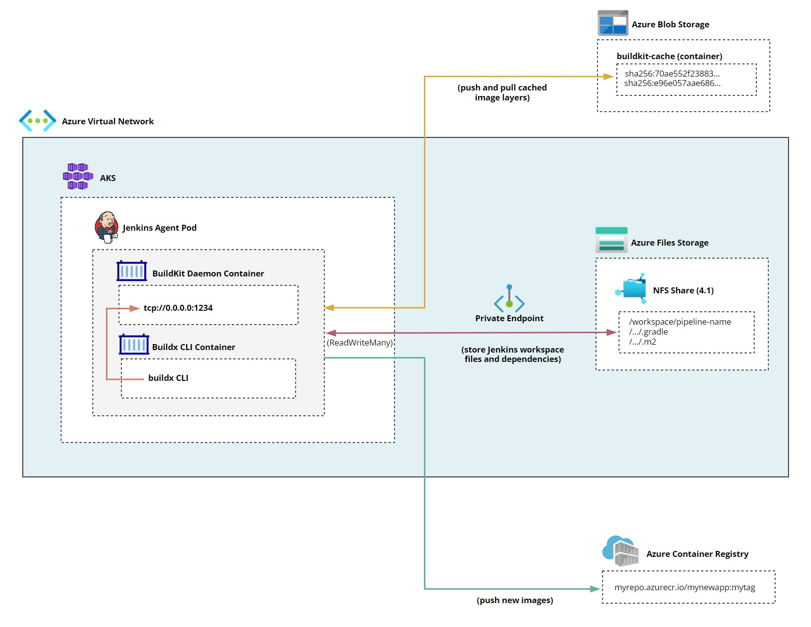
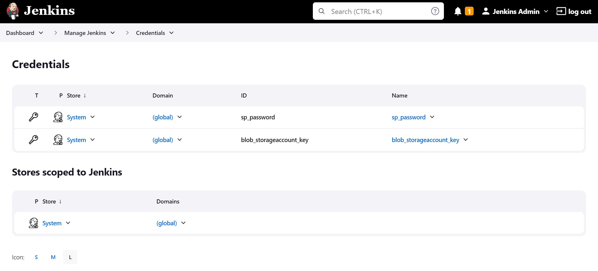
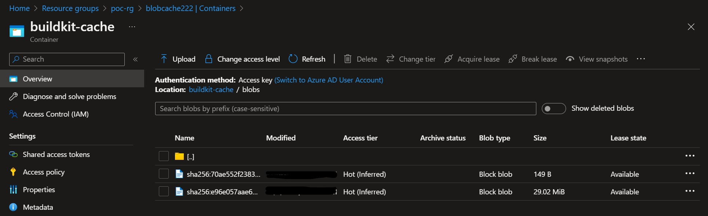
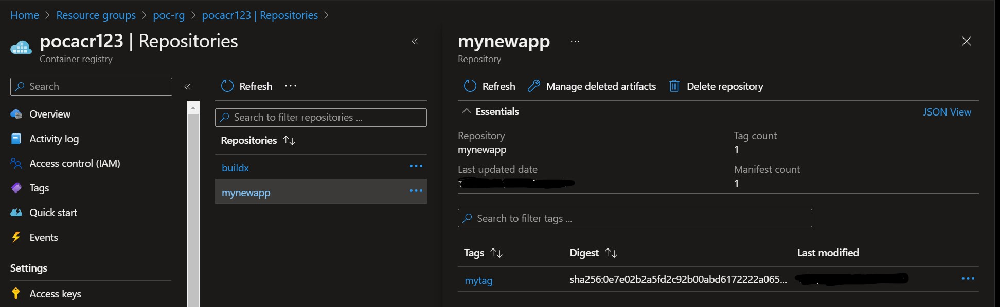
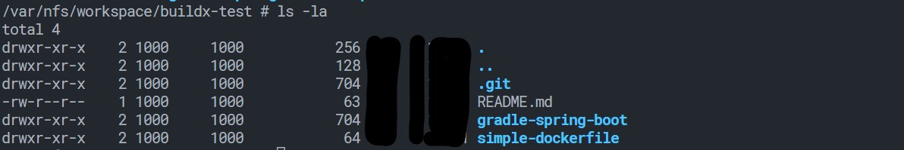
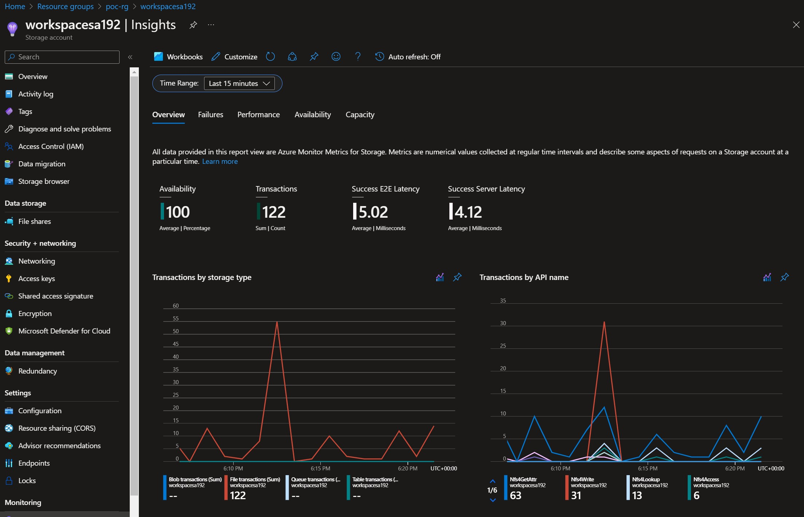
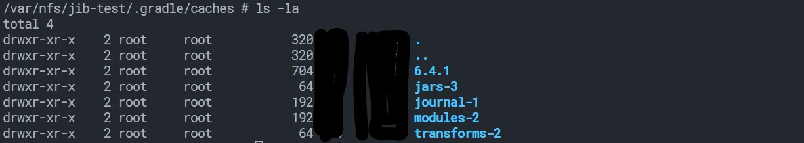
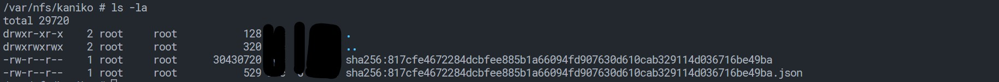

This is second article from the series **Jenkins on Azure Kubernetes Cluster (AKS)**:

1. [Jenkins on Azure Kubernetes Cluster (AKS) - How to recover Jenkins controller from Azure availability zone or region failure](https://rhollins.github.io/content/posts/jenkins-on-azure-kubernetes-cluster-aks-how-to-recover-jenkins-controller-from-azure-availability-zone-or-region-failure/)

2. Jenkins on Azure Kubernetes Cluster (AKS) - How to build container images with BuildKit, Jib, Kaniko and use Azure Files NFS, Azure Container Registry (ACR) and Azure Blob storage for caching

3. [Jenkins on Azure Kubernetes Cluster (AKS) - Flexible and cost effective Jenkins Agents with Kubernetes Cluster Autoscaler and Azure Spot Virtual Machines](https://rhollins.github.io/content/posts/jenkins-on-azure-kubernetes-cluster-aks-flexible-and-cost-effective-jenkins-agents-with-kubernetes-cluster-autoscaler-and-azure-spot-virtual-machines)

Table of contents

* [What we will cover in this article](#what-we-will-cover-in-this-article)
* [Setting up our environment](#setting-up-our-environment)
    * [Deploying Virtual Network, AKS and Jenkins](#deploying-virtual-network-aks-and-jenkins)
    * [Deploying Azure Files NFS share with Private Endpoint and Private DNS Zone](deploying-azure-files-nfs-share-with-private-endpoint-and-private-dns-zone)
    * [Creating Blob Storage Account, Azure Container Registry (ACR) and Service Principle account.](#creating-blob-storage-account-azure-container-registry-acr-and-service-principle-account)
* [Building container image with BuildKit and Buildx](#building-container-image-with-buildkit-and-buildx)
    * [How to further improve the speed of Jenkins pipeline](#how-to-further-improve-the-speed-of-jenkins-pipeline)
* [Building container image using Jib](#building-container-image-using-jib)
* [Building container image using Kaniko](#building-container-image-using-kaniko)
* [Final thoughts](#final-thoughts)

## What we will cover in this article

It is no longer possible to run Docker outside of Docker (Dood) in Kubernetes to build containers. In this post, we will cover three alternatives like [BuildKit](https://github.com/moby/buildkit), [Kaniko](https://github.com/GoogleContainerTools/kaniko), and [Jib](https://github.com/GoogleContainerTools/jib) and try to integrate them with other Azure resources.

Azure Container Registry (ACR) will be used to store and cache images, one of the challenges solved in this article is the authentication since we don't want to use an unsecure [admin user](https://learn.microsoft.com/en-us/azure/container-registry/container-registry-authentication?tabs=azure-cli#admin-account) but instead utilize other Azure AD authentication methods.

We will also use Azure Files NFS share which due to its pretty good [performance](https://learn.microsoft.com/en-us/azure/storage/files/storage-files-scale-targets) and the fact that it allows [ReadWriteMany](https://kubernetes.io/docs/concepts/storage/persistent-volumes/#access-modes) access mode could be potentially used to not only cache container image layers, Gradle, maven or npm dependencies but also to cache and host multiple Jenkins agents workspaces.

Azure Blob store will be used to cache image layers with Buildx CLI which currently has this functionality in [preview](https://docs.docker.com/build/building/cache/backends/azblob/).

Here is the summary of the components we will be using and configuring:

* NFS file shares in Azure Files Premium with Private Endpoint, Azure Blob store, Azure Container Registry (ACR)
* AKS deployed in a subnet with Azure Container Networking Interface (CNI)
* Inside AKS we will be deploying Jenkins community Helm chart and also using BuildKit, Kaniko, Jib as agent containers

## Setting up our environment

### Deploying Virtual Network, AKS and Jenkins

Since we did it already in the previous article you can use it for reference [Jenkins on Azure Kubernetes Cluster (AKS) - How to recover Jenkins controller from Azure availability zone or region failure](https://rhollins.github.io/content/posts/jenkins-on-azure-kubernetes-cluster-aks-how-to-recover-jenkins-controller-from-azure-availability-zone-or-region-failure/). Just ensure to set AKS system nodepool to bigger size VM, for example, **Standard_DS2_v2** since we will be hosting there Jenkins agents as well. Also inside Jenkins Helm chart values, you can remove affinity rules because we will have one node pool and skip ingress resource since we can just forward to Jenkins service port to access UI.

### Deploying Azure Files NFS share with Private Endpoint and Private DNS Zone

First, we will deploy Azure Files with our NFS share that will be used to host Jenkins agent's workspaces and where we will cache other dependencies.

Create a storage account and NFS share

    az storage account create -n workspacesa192 -g poc-rg -l westus2 --sku Premium_ZRS --kind FileStorage --https-only false
    az storage share-rm create --storage-account workspacesa192 --enabled-protocol NFS --name "aksshare" --quota 100

Create a subnet for our private endpoint NIC and then the Private Endpoint itself

    SUBNET_ID=$(az network vnet subnet show --resource-group poc-rg --vnet-name poc-vnet --name pe-subnet --query "id" -o tsv)
    SA_ID=$(az storage account show --resource-group poc-rg --name workspacesa192 --query "id" -o tsv)
    az network vnet subnet update --ids $SUBNET_ID --disable-private-endpoint-network-policies

    PE_ID=$(az network private-endpoint create \
      --resource-group poc-rg \
      --name "workspacesa192-PrivateEndpoint" \
      --location westus2 \
      --subnet $SUBNET_ID \
      --private-connection-resource-id $SA_ID\
      --group-id "file" \
      --connection-name "workspacesa192-Connection" \
      --query "id" -o tsv)

Create Azure Private DNS Zone which will use to access our Private Endpoint and then create a DNS record for our Azure Files endpoint.

    DNS_ZONE_NAME="privatelink.file.core.windows.net"
    VNET_ID=$(az network vnet show --resource-group poc-rg --name poc-vnet --query "id" -o tsv)
    az network private-dns zone create --resource-group poc-rg --name $DNS_ZONE_NAME --query "id" -o tsv

    DNS_ZONE_ID=$(az network private-dns zone show  --resource-group poc-rg --name $DNS_ZONE_NAME --query "id")
    az network private-dns link vnet create --resource-group poc-rg --zone-name $DNS_ZONE_NAME --name "poc-vnet-DnsLink" --virtual-network $VNET_ID --registration-enabled false

    PE_NIC=$(az network private-endpoint show --ids $PE_ID --query "networkInterfaces[0].id" -o tsv)
    PE_IP=$(az network nic show --ids $PE_NIC --query "ipConfigurations[0].privateIpAddress" -o tsv)
    az network private-dns record-set a create --resource-group poc-rg --zone-name $DNS_ZONE_NAME --name workspacesa192
    az network private-dns record-set a add-record --resource-group poc-rg --zone-name $DNS_ZONE_NAME --record-set-name workspacesa192 --ipv4-address $PE_IP

### Creating Blob Storage Account, Azure Container Registry (ACR) and Service Principle account

Let’s create Blob Storage Account and Azure Container Registry for this demo we don’t need to add a Private Endpoint like it was with NFS share.

    az storage account create -n blobcache222 -g poc-rg -l westus2 --kind BlobStorage --access-tier Hot
    az acr create -n pocacr123 -g poc-rg --sku Basic --location westus2

For solutions like BuildKit and Jib, we will need a Service Principle account which will be used to push and pull images from ACR.

    ACR_NAME=pocacr123
    SERVICE_PRINCIPAL_NAME=acrsp
    ACR_REGISTRY_ID=$(az acr show --name $ACR_NAME --query "id" --output tsv)
    PASSWORD=$(az ad sp create-for-rbac --name $SERVICE_PRINCIPAL_NAME --scopes $ACR_REGISTRY_ID --role acrpull --query "password" --output tsv)
    USER_NAME=$(az ad sp list --display-name $SERVICE_PRINCIPAL_NAME --query "[].appId" --output tsv)
    echo $USER_NAME
    echo $PASSWORD

Now that the account is created we need to allow it to push and pull from our ACR.

    ACR_REGISTRY_ID=$(az acr show --name $ACR_NAME --query id --output tsv)
    az role assignment create --assignee $USER_NAME --scope $ACR_REGISTRY_ID --role acrpull
    az role assignment create --assignee $USER_NAME --scope $ACR_REGISTRY_ID --role acrpush

Kaniko doesn’t use an SP account and will be able to use Managed Identity assigned to our K8s cluster so let’s also allow MI to push and pull from ACR.

    export AZ_PRINCIPAL_ID=$(
      az aks show -g poc-rg -n aks-wu \
        --query "identityProfile.kubeletidentity.objectId" \
        --output tsv
    )
    az role assignment create --role acrpull --assignee $AZ_PRINCIPAL_ID --scope $ACR_REGISTRY_ID
    az role assignment create --role acrpush --assignee $AZ_PRINCIPAL_ID --scope $ACR_REGISTRY_ID

## Building container image with BuildKit and Buildx

Now let’s try to build a container using BuildKit, first make sure you can access Jenkins by doing port-forward to the K8s services for Jenkins UI.

    kubectl port-forward services/jenkins 8080:8080 -n default

Before we can create our pipeline let’s locally build the buildx container and push it to our new ACR. We will use this container to run buildx CLI commands. You will need [Docker Desktop](https://www.docker.com/products/docker-desktop/) installed on your local machine. Also, make sure you have enabled buildkit `"buildkit": true` in your docker config.

Login to ACR, build the container, and push to our repo.

    az acr login -n pocacr123 -g poc-rg

    docker buildx build \
      --tag pocacr123.azurecr.io/buildx --push . -f - <<EOF
    # syntax=docker/dockerfile:1
    FROM docker
    COPY --from=docker/buildx-bin /buildx /usr/libexec/docker/cli-plugins/docker-buildx
    RUN docker buildx version
    EOF

We also have to create Jenkins credentials for the Blob Storage Account key as well as a password for our Service Principle account which will be used to push the new image. If you need help [here](https://learn.microsoft.com/en-us/azure/storage/common/storage-account-keys-manage?tabs=azure-portal) is info on how to find your Storge Account key and [here](https://www.jenkins.io/doc/book/using/using-credentials/) how to add Jenkins secret text credentials.

Ok now that we have everything in place let’s create a new Jenkins pipeline with the following content and run it (the `--username` here should be your application id)

    podTemplate(
      inheritFrom: 'default',
      workspaceVolume: nfsWorkspaceVolume(serverAddress: 'workspacesa192.file.core.windows.net', serverPath: '/workspacesa192/aksshare', readOnly: false),
      containers: [
        containerTemplate(name: 'buildx', image: 'pocacr123.azurecr.io/buildx', ttyEnabled: true, command: 'sleep', args: '99d'),
        containerTemplate(name: 'buildkit', image: 'moby/buildkit:master', ttyEnabled: true, privileged: true, command: 'buildkitd --addr tcp://0.0.0.0:1234')
      ]) {
        node(POD_LABEL) {
            stage('Main Stage') {
                container('buildx') {
                    stage('inside buildx container stage') {
                        git 'https://github.com/rhollins/example-apps.git'
                        withCredentials([string(credentialsId: 'sp_password', variable: 'SP_PASSWORD'),
                                        string(credentialsId: 'blob_storageaccount_key', variable: 'BLOB_STORAGEACCOUNT_KEY')]) {
                          sh """
                            docker buildx create --name remote --driver remote tcp://localhost:1234
                            docker buildx use remote
                            docker buildx ls
                            docker login pocacr123.azurecr.io --username s910b50s-3f94-43d0-4d22-00000000 --password $SP_PASSWORD
                            docker buildx build \
                              --push \
                              --cache-from type=azblob,account_url=https://blobcache222.blob.core.windows.net/,secret_access_key=$BLOB_STORAGEACCOUNT_KEY,mode=max \
                              --cache-to type=azblob,account_url=https://blobcache222.blob.core.windows.net/,secret_access_key=$BLOB_STORAGEACCOUNT_KEY,mode=max \
                              --tag pocacr123.azurecr.io/mynewapp:mytag \
                              ./simple-dockerfile
                          """
                        }
                    }
                }
            }
        }
    }

* We use `inheritFrom` to make sure our pods will inherit specific settings from the parent template. This is useful when you for example use an affininty setting that should apply to all pipelines.
* `workspaceVolume` will map our NFS share as a workspace directory for this particular agent. We can run multiple agents which can all mount this NFS share at the same time and store data in separate directories.
* `moby/buildkit:master` container to run BuildKit daemon.
* `pocacr123.azurecr.io/buildx` container will use buildx CLI to call BuildKit daemon as our remote builder.
* buildx command will use `--cache-from` and `--cache-to` to cache our layers and also use already cached layers on subsequent runs.

What you will notice is that on the next run this pipeline is much faster that’s because of caching.

To find cached image layers you can go to Blob Storage Account and then to **buildkit-cache** container

You will also find your built image in the ACR repository.

We can also access NFS share to check our Jenkins workspace files. Deploy test pod in K8s here is the content of the `nfs-test-pod.yaml` file by running `kubectl apply -f nfs-test-pod.yaml` which will mount our share under `/var/nfs`.

    apiVersion: v1
    kind: Pod
    metadata:
      name: myapp
    spec:
      containers:
      - name: myapp
        image: busybox
        command: ["/bin/sh", "-ec", "sleep 1000"]
        volumeMounts:
          - name: nfs
            mountPath: /var/nfs
      volumes:
      - name: nfs
        nfs:
          server: workspacesa192.file.core.windows.net
          path: "/workspacesa192/aksshare"

Once deployed just use the terminal inside this pod and there you will find Jenkins workspace files from the last build.

### How to further improve the speed of Jenkins pipeline

You should use Azure Private Endpoints with both Azure Container Registry and Blob Storage Account this will greatly improve network latency.

To test NFS share performance you can install the tool [kubestr](https://kubestr.io/).

    curl -LO https://github.com/kastenhq/kubestr/releases/download/v0.4.36/kubestr_0.4.36_Linux_amd64.tar.gz
    tar -xvf kubestr_0.4.36_Linux_amd64.tar.gz

Then create StorageClass for NFS share.

    apiVersion: storage.k8s.io/v1
    kind: StorageClass
    metadata:
      name: azurefile-csi-nfs-specific
    provisioner: file.csi.azure.com
    allowVolumeExpansion: true
    parameters:
      storageAccount: workspacesa192
      resourceGroup: poc-rg
      shareName: aksshare
      server: workspacesa192.file.core.windows.net
      protocol: nfs
    mountOptions:
      - nconnect=8

At the end just run kubestr against this `StorageClass` and it will give you some indication of the performance, which you can then use to further tweak your builds.

    ./kubestr fio -s nfs-sc-specific

Remember that the bigger the NFS share the better performance but also higher costs, also as always with Azure worth to check what are the resource limits.

Azure also offers an overview of NFS share performance so you can see utilization in real-time and potentially check for bottlenecks.

> **Tip:** [Here](https://github.com/jenkinsci/kubernetes-plugin/blob/master/examples/dind.groovy) is another way which utilize Docker-in-Docker in Jenkins pipeline.

## Building container image using Jib

Before we run this pipeline create directory `/workspacesa192/aksshare/jib-test/` in the NFS share. It will be used to cache Gradle build dependencies. You can use the test pod we have deployed in the previous Buildx example to get access to NFS share.

    podTemplate(
      inheritFrom: 'default',
      workspaceVolume: nfsWorkspaceVolume(serverAddress: 'workspacesa192.file.core.windows.net', serverPath: '/workspacesa192/aksshare', readOnly: false),
      containers: [
        containerTemplate(name: 'gradle', image: 'gradle:6.4.1-jdk11', ttyEnabled: true, command: 'sleep', args: '99d'),
        containerTemplate(name: 'docker', image: 'docker', ttyEnabled: true, command: 'sleep', args: '99d')
      ],
      volumes: [
        nfsVolume(serverAddress: 'workspacesa192.file.core.windows.net', serverPath: '/workspacesa192/aksshare/jib-test/.gradle', mountPath: '/home/gradle/.gradle', readOnly: false),
        hostPathVolume(hostPath: '/root/.docker', mountPath: '/root/.docker')
      ]) {
        node(POD_LABEL) {
            stage('Main Stage') {
                container('docker') {
                    stage('inside docker container stage') {
                        withCredentials([string(credentialsId: 'sp_password', variable: 'SP_PASSWORD')]) {
                          sh '''
                            docker login pocacr123.azurecr.io --username s910b50s-3f94-43d0-4d22-00000000 --password $SP_PASSWORD
                          '''
                        }
                    }
                }
                container('gradle') {
                    stage('inside gradle container stage') {
                        git 'https://github.com/rhollins/example-apps.git'
                        sh '''
                          cd ./gradle-spring-boot
                          gradle clean build
                          gradle jib
                        '''
                    }
                }
            }
        }
    }
* We use `docker` image to authenticate with the ACR registry.
* `hostPathVolume` is used to mount docker `config.json` file which contains auth token for ACR and makes it available to the Gradle container and Jib.
* `nfsVolume` is used to mount `.gradle` cache directory in NFS share so that we can reuse it and save time on downloading dependencies on next run.

> **Note:** It would be good idea to test running multiple pipeline instances at the same time and check if it cause any problems when they start overwriting Gradle cache simultaneously.

Inside the NFS share we can see that Gradle successfully stored dependencies.

## Building container image using Kaniko

Before we run this pipeline create the directory `/workspacesa192/aksshare/kaniko` in the NFS share. It will be used to cache container images. You can use the test pod deployed in the previous Buildx example to get access to NFS share.

First, we will create a pipeline to run Kaniko warmer container which will pre-download the base image to NFS share.

    podTemplate(
        yaml: '''
          kind: Pod
          metadata:
            name: kaniko-warmer
          spec:
            containers:
            - name: kaniko-warmer
              image: gcr.io/kaniko-project/warmer:latest
              args: ["--cache-dir=/cache",
                    "--image=ubuntu"]
              volumeMounts:
                - name: kaniko-cache
                  mountPath: /cache
            volumes:
            - name: kaniko-cache
              nfs:
                server: workspacesa192.file.core.windows.net
                path: "/workspacesa192/aksshare/kaniko"
    '''
      ) {
      node(POD_LABEL) {
        stage('Build with Kaniko') {
          sh 'sleep 30s'
        }
        stage('Logs') {
          containerLog('kaniko-warmer')
        }
      }
    }
We can verify that the layers have been downloaded successfully.

Kaniko can use [Managed Identity](https://learn.microsoft.com/en-us/azure/active-directory/managed-identities-azure-resources/overview) assigned to the AKS cluster to authenticate with ACR and push the image. We have to create a configmap that contains `config.json` file with `crdHelper` definition.

Content of the file config.json

    { "credHelpers": { "pocacr123.azurecr.io": "acr-env" } }

Create configmap by running this command.

    kubectl create configmap docker-config --from-file=./config.json

Then we can create a Jenkins pipeline and run it.

    podTemplate(
        volumes: [
          nfsVolume(serverAddress: 'workspacesa192.file.core.windows.net', serverPath: '/workspacesa192/aksshare/kaniko', mountPath: '/kaniko', readOnly: false)
        ],
        yaml: '''
          kind: Pod
          spec:
            containers:
            - name: kaniko
              image: gcr.io/kaniko-project/executor:v1.9.1-debug
              imagePullPolicy: Always
              command:
              - sleep
              args:
              - 99d
              volumeMounts:
                - name: docker-config
                  mountPath: /kaniko/.docker/
            volumes:
              - name: docker-config
                configMap:
                  name: docker-config
            restartPolicy: Never
    '''
      ) {

      node(POD_LABEL) {
        stage('Build with Kaniko') {
          git 'https://github.com/rhollins/example-apps.git'
          container('kaniko') {
            sh '/kaniko/executor -f `pwd`/simple-dockerfile/Dockerfile -c `pwd` --verbosity debug --destination=pocacr123.azurecr.io/kanikoexample:mytag -cache --cache-dir=/kaniko'
          }
        }
      }
    }

* We use `nfsVolume` to mount `/workspacesa192/aksshare/kaniko` directory which contains a cached base image.
* We also mount configmap `docker-config` to instruct Kaniko how to authenticate with our ACR, in this case, it will be done by MI assigned to AKS.

## Final thoughts

* We haven’t mentioned [Buildx Kubernetes](https://docs.docker.com/build/building/drivers/kubernetes/) driver which allows you to create multiple container builders that can be run as for example K8s ad-hoc jobs to reduce cost. You can even use bilders from Dev team machines to use cloud resources.