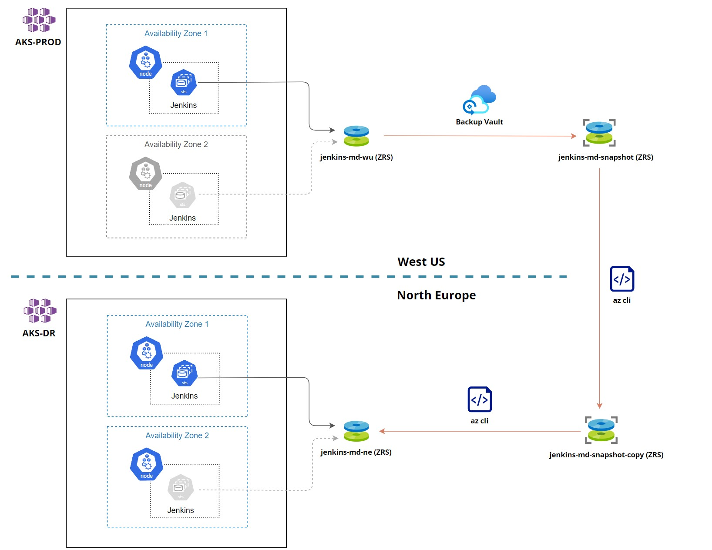
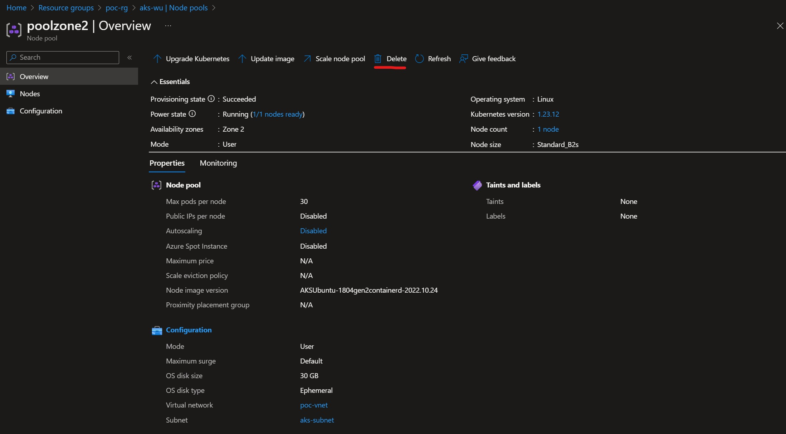
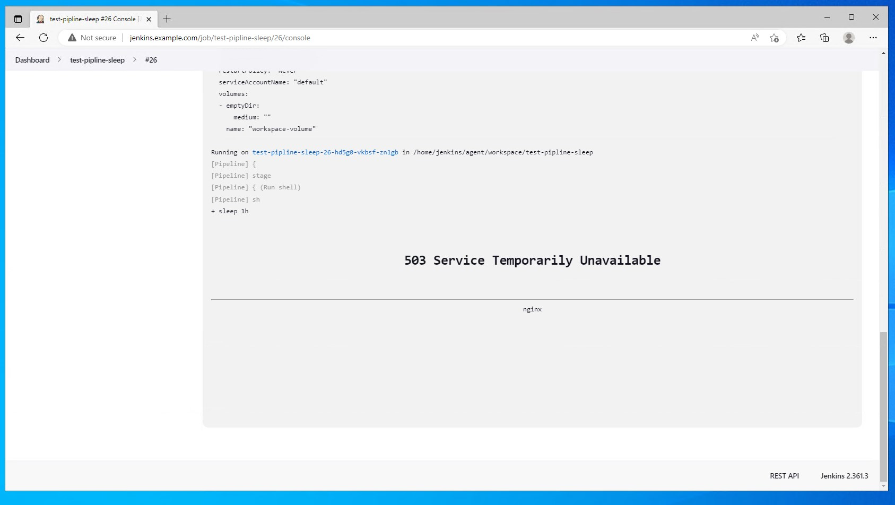
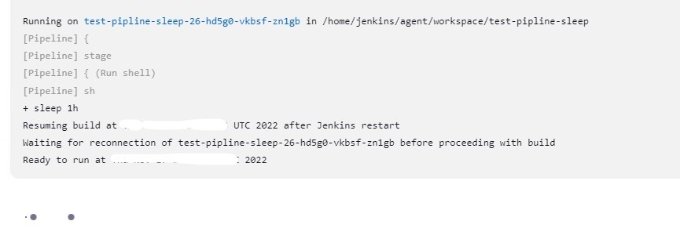
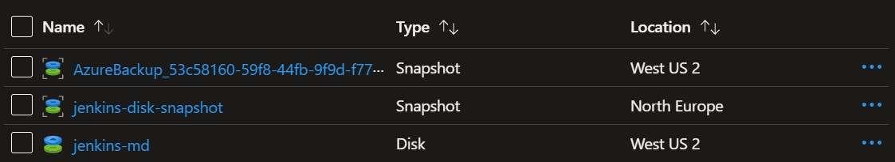
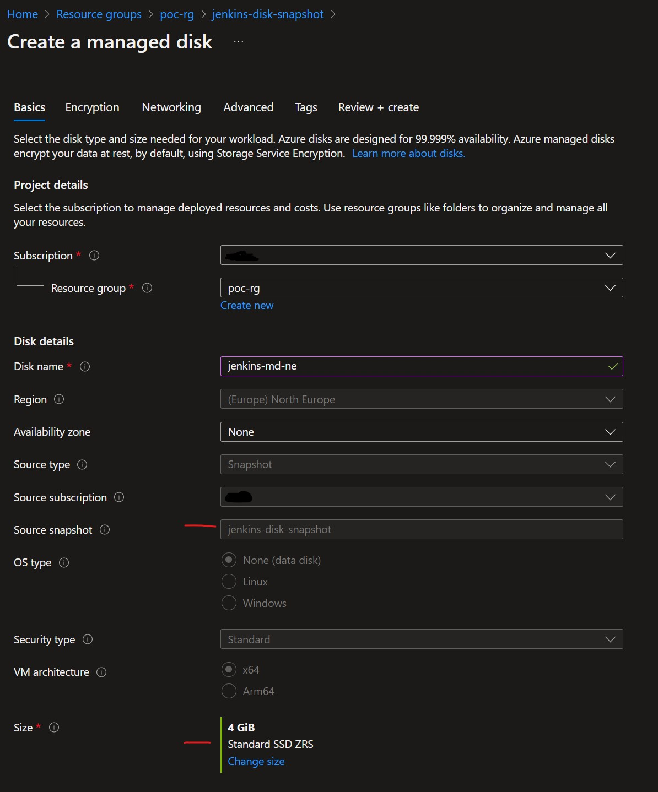
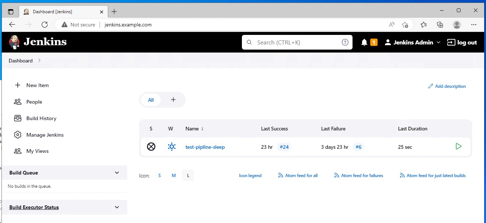

Jenkins is still a very popular CI/CD tool used by a lot of companies if you want to run it in Azure there are some usual options to choose from including stand alone VM's or Azure Virtual Machine Scale Sets, but in this article, we will use AKS for both Jenkins controller and agents.

When deploying any solution there are a lot of things to consider like security, maintenance overhead, and cost but also reliability, and this last one is what we will focus on, in particular, we will try to answer the question: How to recover Jenkins from Azure zone and region failure.

In the beginning, we should put some boundaries around our expectations since this is a simple POC we still want almost instant RPO and RTO for zone failures but we are good with an hour or so for RPO and RTO in case of regional failure let's just say it's "lunchtime" RTO (Jenkins has to be up before Dev team comes back from lunch).

What are some of the storage offerings that we have in Azure that can help us with those requirements:

* [Azure NetApp Files](https://learn.microsoft.com/en-us/azure/azure-netapp-files/azure-netapp-files-introduction) - This is enterprise-grade storage solution which can be also used with tools like [Astra Control Service](https://azuremarketplace.microsoft.com/en-GB/marketplace/apps/netapp.netapp-astra-acs). But in our case, it might be overkill, especially since the minimum size of the capacity pool is 4TB which is way too much for what we need. Perhaps this solution should be considered when planning a wider strategy of hosting stateful AKS workloads.

* [Azure Files](https://learn.microsoft.com/en-us/azure/storage/files/storage-files-introduction) - It is PAAS offering for hosting SMB/NFS storage. The "transactional" tier might be fast enough to host Jenkins controller home directory however there are a few problems that I found with regional failover. You cannot replicate to other regions than paired one and sometimes this is not an option. Testing failover is potentially destructive if you will not keep an eye on synchronization. When failover is done the storage account is changed into LRS (locally redundant storage) and cannot be converted back into GZRS (geo-zone-redundant storage).

* [Managed Disks with Zone-redundant storage (ZRS)](https://learn.microsoft.com/en-gb/azure/virtual-machines/disks-redundancy#zone-redundant-storage-for-managed-disks) - Managed disks will be synchronously replicated across three availability zones inside the region which simplifies our zone failover as we can use AKS nodes in the different region connected to the same disk after one of the zones will be gone. Unfortunately, ZRS disks are currently only available in a handful of Azure regions but hopefully, it will change soon.

Here are some of the components we will be using and configuring:

* AKS deployed in a subnet with Azure Container Networking Interface (CNI) and NGINX Ingress Controller.
* Azure Backup Vault (sometimes confused with Recovery Service Vault)
* Azure Zone Redundant Managed Disks and Snapshots

## Testing Availbility Zone Failover

To test the Availability Zone failover we will deploy AKS cluster in West US 2 region with two node pools each in a different zone, after that we will deploy Jenkins which utilizes zones through affinity rules, and at the end perform a test failover by deleting the active node and checking how Jenkins recovers.

### Create VNet and AKS with NGINX Ingress Controller

Create Virtual Networks and subnet for AKS and client test machine (which you might don't need if you whish to use forwarding instead)

    az group create \
    --location westus2 \
    --name poc-rg

    az network vnet create \
    --name poc-vnet \
    --resource-group poc-rg \
    --location westus2 \
    --address-prefix 10.0.0.0/16 \
    --subnet-name aks-subnet \
    --subnet-prefixes 10.0.1.0/24

    az network vnet subnet create \
    --address-prefix 10.0.2.0/24 \
    --name client-subnet \
    --resource-group poc-rg \
    --vnet-name poc-vnet

Create AKS Cluster.

> **Note:** It is important to note that in real life scenario you should also create zone redundant systempool

    az aks create \
        -g poc-rg\
        -n aks-wu \
        --location westus2 \
        --enable-managed-identity \
        --load-balancer-sku standard \
        --node-count 1 \
        --nodepool-name systempool \
        --generate-ssh-keys \
        --network-plugin azure \
        --vnet-subnet-id /subscriptions/<subscription_id>/resourceGroups/poc-rg/providers/Microsoft.Network/virtualNetworks/poc-vnet/subnets/aks-subnet \
        --docker-bridge-address 172.17.0.1/16 \
        --dns-service-ip 10.2.0.10 \
        --service-cidr 10.2.0.0/24 \
        --node-vm-size Standard_B2s \
        --node-osdisk-size 30

    az aks get-credentials --name aks-wu --resource-group poc-rg --overwrite-existing --admin

Provide permissions to AKS managed identity account so that it can attach managed disks located inside our resource group and allocate IP's in cluster subnet.

    export AZ_PRINCIPAL_ID=$(
    az aks show -g poc-rg -n aks-wu \
        --query "identity.principalId" \
        --output tsv
    )

    az role assignment create --role "Contributor" --assignee $AZ_PRINCIPAL_ID --scope /subscriptions/<subscription_id>/resourceGroups/poc-rg
    az role assignment create --role "Network Contributor" --assignee $AZ_PRINCIPAL_ID --scope /subscriptions/<subscription_id>/resourceGroups/poc-rg/providers/Microsoft.Network/virtualNetworks/poc-vnet

To deploy NGINX Ingress Controller first create helm values file **internal-ingress.yaml** with the following content, this will create another Azure Load Balancer and allocate static private IP to Ingress Controller service.

    controller:
        service:
            loadBalancerIP: 10.0.1.251
            annotations:
            service.beta.kubernetes.io/azure-load-balancer-internal: "true"

Then deploy NGINX Ingress Controller chart (we are using the community version):

    helm repo add ingress-nginx https://kubernetes.github.io/ingress-nginx
    helm repo update
    helm install ingress-nginx ingress-nginx/ingress-nginx \
        --namespace default \
        --set controller.service.annotations."service\.beta\.kubernetes\.io/azure-load-balancer-health-probe-request-path"=/healthz \
        -f internal-ingress.yaml

Now we will add to AKS two new node pools each in different zones to host our Jenkins controller.

    az aks nodepool add \
        --name poolzone1 \
        --resource-group poc-rg \
        --cluster-name aks-wu \
        --node-count 1 \
        --vnet-subnet-id /subscriptions/<subscription_id>/resourceGroups/poc-rg/providers/Microsoft.Network/virtualNetworks/poc-vnet/subnets/aks-subnet \
        --node-vm-size Standard_B2s \
        --node-osdisk-size 30 \
        --zones 1

    az aks nodepool add \
        --name poolzone2 \
        --resource-group poc-rg \
        --cluster-name aks-wu \
        --node-count 1 \
        --vnet-subnet-id /subscriptions/<subscription_id>/resourceGroups/poc-rg/providers/Microsoft.Network/virtualNetworks/poc-vnet/subnets/aks-subnet \
        --node-vm-size Standard_B2s \
        --node-osdisk-size 30 \
        --zones 2

### Create Managed Disk and Configure Jenkins Storage

Once we have nodes ready which you can verify by running the command `kubectl get no` it is time to create ZRS managed disk which will be used to host home directory of Jenkins controller.

    az disk create \
    --name jenkins-md \
    --resource-group poc-rg \
    --sku StandardSSD_ZRS \
    --location westus2 \
    --size-gb 4

We also need to create **PV**, **SC**, and **PVC** which will be used to attach this managed disk to the Jenkins controller pod. Here we also ensure that **reclaimPolicy** is set to **Retain** since we are managing disk externally to AKS.

jenkins-sc.yaml

    allowVolumeExpansion: true
    apiVersion: storage.k8s.io/v1
    kind: StorageClass
    metadata:
      name: jenkins-sc
    parameters:
      skuname: StandardSSD_ZRS
    provisioner: disk.csi.azure.com
    reclaimPolicy: Retain
    volumeBindingMode: WaitForFirstConsumer

jenkins-pv.yaml

    apiVersion: v1
    kind: PersistentVolume
    metadata:
      name: jenkins-pv
    spec:
      accessModes:
      - ReadWriteOnce
      capacity:
        storage: 4Gi
      csi:
        driver: disk.csi.azure.com
        volumeHandle: /subscriptions/<subscription_id>/resourceGroups/poc-rg/providers/Microsoft.Compute/disks/jenkins-md
      persistentVolumeReclaimPolicy: Retain
      claimRef:
        name: jenkins-pvc
        namespace: default
      storageClassName: jenkins-sc
      volumeMode: Filesystem

jenkins-pvc.yaml

    apiVersion: v1
    kind: PersistentVolumeClaim
    metadata:
      annotations:
        meta.helm.sh/release-name: jenkins
        meta.helm.sh/release-namespace: default
        volume.beta.kubernetes.io/storage-provisioner: disk.csi.azure.com
        volume.kubernetes.io/storage-provisioner: disk.csi.azure.com
      labels:
        app.kubernetes.io/component: jenkins-controller
        app.kubernetes.io/instance: jenkins
        app.kubernetes.io/managed-by: Helm
        app.kubernetes.io/name: jenkins
      name: jenkins-pvc
      namespace: default
    spec:
      accessModes:
      - ReadWriteOnce
      resources:
        requests:
          storage: 4Gi
      storageClassName: jenkins-sc

Once files are ready just run kubectl to apply all:

    kubectl apply -f jenkins-sc.yaml
    kubectl apply -f jenkins-pv.yaml
    kubectl apply -f jenkins-pvc.yaml

### Deploy and configure Jenkins

Before we deploy Jenkins we need to prepare Helm values file. Create file **jenkins.values.yaml** with following content.

We are setting a few things here:
* Create an ingress resource
* Specify affinity rules to ensure that pod can only be created in either of two specific zones in Azure
* Indicate we want to use our pre-created PVC **jenkins-pvc**

Content of **jenkins.values.yaml**

    controller:
      ingress:
        enabled: true
        annotations:
          kubernetes.io/ingress.class: nginx
        hostName: jenkins.example.com
      affinity:
        nodeAffinity:
          requiredDuringSchedulingIgnoredDuringExecution:
            nodeSelectorTerms:
            - matchExpressions:
              - key: topology.kubernetes.io/zone
                operator: In
                values:
                - westus2-1
                - westus2-2
    persistence:
      existingClaim: jenkins-pvc

Then we deploy jenkins.

    helm repo add jenkins https://charts.jenkins.io
    helm repo update
    helm install jenkins jenkins/jenkins \
      --namespace default \
      -f jenkins.values.yaml

To verify if managed disk has been attached check latest events on jenkins pod with command **kubectl describe pod jenkins-0**.

Also as you can see our pod has been deployed to node pool in zone 2.

    Type     Reason                  Age   From                     Message
    ----     ------                  ----  ----                     -------
    Normal   Scheduled               67s   default-scheduler        Successfully assigned default/jenkins-0 to aks-poolzone2-27948138-vmss000000
    Normal   SuccessfulAttachVolume  58s   attachdetach-controller  AttachVolume.Attach succeeded for volume "jenkins-pv"

Now from the client machine which has private network access to Jenkins subnet, we will try to open Jenkins website, since we are using ingress resource make sure to link IP of NGINX Ingress Controller in our case 10.0.1.251 with the custom hostname which we specified in Helm values files.

You can login with username **admin** and password which as been generated and it's located in secret called **jenkins** which is in the same namespace as jenkins deployment.

Once logged in let's create a simple pipeline which we will use during test failover.
Choose **New Item** then **pipeline** and in the script, box copy and paste this content:

    podTemplate (inheritFrom: 'default') {
        node(POD_LABEL) {
            stage('Run shell') {
                sh 'sleep 1h'
            }
        }
    }

Now let's start the pipeline, you should see the following output in the pipeline console output.

    Running on test-pipline-sleep-26-hd5g0-vkbsf-zn1gb in /home/jenkins/agent/workspace/test-pipline-sleep
    [Pipeline] {
    [Pipeline] stage
    [Pipeline] { (Run shell)
    [Pipeline] sh
    + sleep 1h

If you look at running pods you should see the one created for our Jenkins job **test-pipline-sleep**.

    NAME                                        READY   STATUS    RESTARTS   AGE   IP          NODE                                 NOMINATED NODE   READINESS GATES
    test-pipline-sleep-26-hd5g0-vkbsf-zn1gb     1/1     Running   0          71s   10.0.1.34   aks-poolzone1-11650587-vmss000000    <none>           <none>

### Test Availability Zone failover

Now that the pipeline is running let us simulate the loss of Availability Zone 2 which is where Jenkins pod is running so we will just delete AKS node pool in this zone.

You will notice error in Jenkins website as the controller pod is gone:

If you would run `kubectl get pods -w` you would notice that around 2 minutes have passed between deleting the original pod and running a new one.

    NAME                                        READY   STATUS    RESTARTS   AGE
    jenkins-0                                   2/2     Running   0          46s
    jenkins-0                                   2/2     Terminating   0          65s
    jenkins-0                                   0/2     Terminating   0          66s
    jenkins-0                                   0/2     Terminating   0          66s
    jenkins-0                                   0/2     Terminating   0          66s
    jenkins-0                                   0/2     Pending       0          0s
    jenkins-0                                   0/2     Pending       0          0s
    jenkins-0                                   0/2     Init:0/1      0          0s
    jenkins-0                                   0/2     Init:0/1      0          67s
    jenkins-0                                   0/2     PodInitializing   0          81s
    jenkins-0                                   1/2     Running           0          89s
    jenkins-0                                   1/2     Running           0          105s
    jenkins-0                                   2/2     Running           0          106s

When you describe the Jenkins pod you would see that we also hit the *Multi-Attach error* which might be caused by some kind of race condition where PV is still attached to the previous node while the new POD is trying to claim it and since we set **accessModes** to **ReadWriteOnce** only one can claim it at the time.

Eventually pod will recover on it's own and successfully attach the volume.

    Events:
      Type     Reason                  Age   From                     Message
      ----     ------                  ----  ----                     -------
      Normal   Scheduled               117s  default-scheduler        Successfully assigned default/jenkins-0 to aks-poolzone1-29081885-vmss000000
      Warning  FailedAttachVolume      117s  attachdetach-controller  Multi-Attach error for volume "jenkins-pv" Volume is already exclusively attached to one node and can't be attached to another
      Normal   SuccessfulAttachVolume  77s   attachdetach-controller  AttachVolume.Attach succeeded for volume "jenkins-pv"

Now that we have Jenkins running again let's check the interface you will notice that the pod running the job is still there as in our case luckily it was running on the node pool that wasn’t affected.

Overall failover was quick and we retained all data up to the point when the zone was deleted.

## Testing Regional Failover

For the region outage, we will rely on the managed disk backup which we will synchronize to another region in our case our primary region will be West US, and failover region will be North Europe.

To perform a backup of managed disk which pod is using we can use for example [Azure Disks Container Storage Interface (CSI)](https://learn.microsoft.com/en-us/azure/aks/azure-disk-csi) to do it from within K8s itself but in this post to make our life easier we will use Azure Backup Vault since it will also sort out the whole orchestration part for us including scheduling and retention.
The limitation here is that the shortest frequency of scheduled backup is one hour and you need to add to it also the time that it takes to copy the backup to another region, since it is incremental in general it shouldn't take to long.

Configuration of the Backup Vault and creating first backup of our disk is actually quite easy and you can do it by following this MS guide [Back up Azure Managed Disks](https://learn.microsoft.com/en-us/azure/backup/backup-managed-disks).

Once done it will create incremental snapshots in the same region as backup vault which means now we need to copy snapshots to our target region in or case North Europe.

We can use Azure CLI for that:

    snapshot_id=$(az snapshot show -n <source_snapshot_name> -g poc-rg --query [id] -o tsv)
    az snapshot create -g poc-rg -n jenkins-disk-snapshot -l northeurope --source $snapshot_id --incremental --copy-start

> **Note:** You can use azure cli command `az snapshot wait` with `--custom` flag to check if copy process has been done in 100%.

Once fininshed you will have zone redundant snapshot copy in our case called **jenkins-disk-snapshot** in North Europe region.

Now to create ZRS managed disk in North Europe from this snapshot just choose **Create Disk** and ensure you set **ZRS size** so that we can use zone redundant disk in our failover DR environment as well.

To test if Jenkins will work with the restored managed disk in the new region just deploy AKS the same way as we did at the begging of this post but in North Europe also remember about following changes:

**jenkins.values.yaml** file will need to have affinity rule updated to use labels with availability zones in North Europe

    controller:
      ingress:
        enabled: true
        annotations:
          kubernetes.io/ingress.class: nginx
        hostName: jenkins.example.com
      affinity:
        nodeAffinity:
          requiredDuringSchedulingIgnoredDuringExecution:
            nodeSelectorTerms:
            - matchExpressions:
              - key: topology.kubernetes.io/zone
                operator: In
                values:
                - northeurope-1
                - northeurope-2
    persistence:
      existingClaim: jenkins-pvc

**jenkins-pv.yaml** will need to point to the new restored managed disk name so in our case **jenkins-md-ne**

    apiVersion: v1
    kind: PersistentVolume
    metadata:
      name: jenkins-pv
    spec:
      accessModes:
      - ReadWriteOnce
      capacity:
        storage: 4Gi
      csi:
        driver: disk.csi.azure.com
        volumeHandle: /subscriptions/<subscription_id>/resourceGroups/poc-rg/providers/Microsoft.Compute/disks/jenkins-md-ne
      persistentVolumeReclaimPolicy: Retain
      claimRef:
        name: jenkins-pvc
        namespace: default
      storageClassName: jenkins-sc
      volumeMode: Filesystem

And to perform final confirmation if our environment in North Europe works fine here is a screenshot from the client machine in DR region pointing to Jenkins with the restored disk. As you can see pipeline that we created is there.

## Final Thoughts

We haven't covered failover of the storage of Jenkins agents like workspaces or cached artifacts which you might want to preserve so this is worth keeping in mind.

It might be worth keeping an eye on the new Azure offering which could be helpful here [AKS cluster persistent volume backup](https://azure.microsoft.com/en-gb/updates/akspvbackupprivatepreview/) but at the moment at least it is still in private preview.

We focused on Azure native solutions in this post but since K8s have such a rich ecosystem of tools it is worth exploring at least some of them, here are few examples: [trilio](https://trilio.io/), [kasten](https://www.kasten.io/), [portworx](https://portworx.com/)